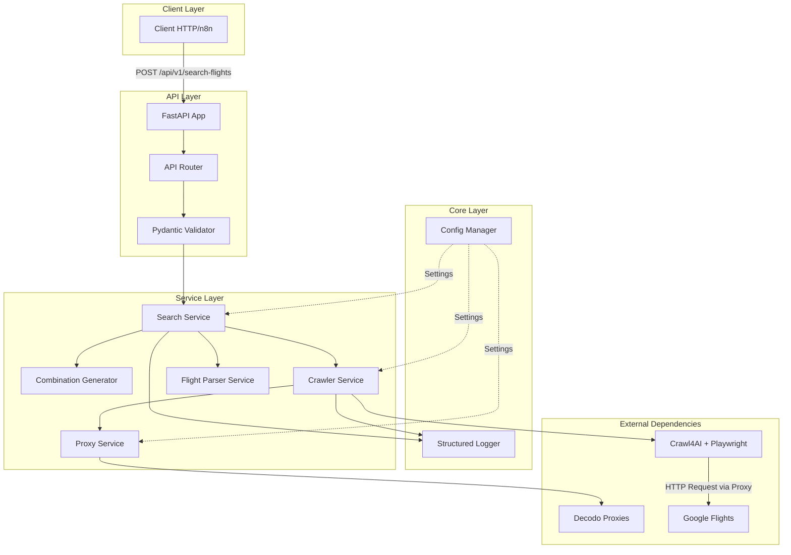
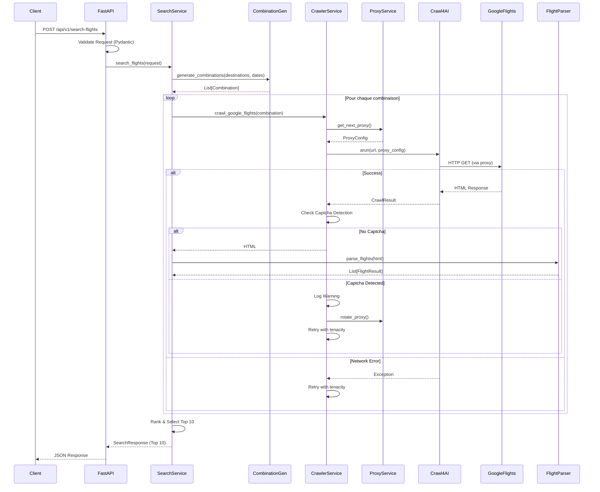

# 🧭 Contexte Projet

## Objectif

Fournir une API RESTful asynchrone permettant de rechercher les meilleures combinaisons de vols multi-destinations en scrapant Google Flights, avec gestion intelligente des proxies, détection de captchas et ranking des résultats.

## Type de Projet

**API RESTful Async** : Service backend stateless de scraping web intelligent avec anti-détection (proxies résidentiels + stealth mode).

## Enjeux & Contraintes

- **Coûts** : Optimiser coûts proxies (<50€/mois) et éviter coûts API LLM
- **Rate Limits** : Gérer limites Google Flights via rotation proxies et retry intelligent
- **Anti-Détection** : Éviter blocages Google (stealth mode + proxies résidentiels France)
- **Performance** : Temps réponse <60s pour recherches multi-city complexes
- **Scalabilité** : Architecture stateless pour scaling horizontal facile
- **Maintenance** : Minimiser dépendance structure HTML Google (monitoring parsing failures)

## Public Cible

- **n8n workflows** : Automation tools cherchant intégration API vols
- **Développeurs** : Cherchant alternative low-cost à SerpAPI
- **Internes** : MVP proof-of-concept scraping intelligent

---

# 🏗️ Architecture Globale

## Architecture — Approche Générale

**Stateless API Async-First** : Monolithe modulaire avec service layer, sans base de données (Top 10 résultats en mémoire).

## Principes Architecturaux

1. **Async-First** : Architecture 100% asynchrone (FastAPI + AsyncWebCrawler)
2. **Stateless** : Pas de base de données, résultats en mémoire (Top 10)
3. **Resilient** : Retry logic avec exponential backoff + jitter
4. **Stealth** : Anti-détection via proxies résidentiels + undetected browser
5. **Cost-Efficient** : Extraction CSS (gratuit) vs LLM (payant)

## Composants Principaux (Haut Niveau)

- **Frontend** : Aucun (API backend uniquement)
- **Backend** : FastAPI async avec routes REST + Pydantic validation
- **Données** : Stateless (Top 10 en mémoire, pas de DB)
- **Processing** : AsyncWebCrawler parallèle + parsing CSS
- **Sécurité** : Proxies résidentiels anti-détection + secrets .env
- **Intégrations Externes** : Decodo Proxies, Crawl4AI, Google Flights

## Patterns Utilisés

- **Async/Await** : Crawling parallèle, I/O non-bloquant
- **Retry Pattern** : Tenacity avec exponential backoff + jitter
- **Service Layer** : Séparation logique business (SearchService, CrawlerService, ProxyService)
- **Dependency Injection** : FastAPI DI pour Config, Logger
- **Strategy Pattern** : Rotation proxies (round-robin)

## Diagramme de Composants



---

# 🌐 Architecture Technique

## 💻 Backend

### Runtime & Langage

**Python 3.13** : Version moderne avec meilleures performances async et type hints (PEP 695).

### Framework

**FastAPI 0.121+** : Framework async moderne avec validation Pydantic v2, auto-documentation OpenAPI, et performances élevées.

### Structure du Code

**Service Layer Pattern** : Séparation claire responsabilités (API routes → Services → External APIs).

```
app/
├── api/routes.py          # Routes FastAPI
├── core/                  # Config + Logger
├── models/                # Pydantic models (request/response)
├── services/              # Business logic
│   ├── search_service.py
│   ├── crawler_service.py
│   ├── proxy_service.py
│   └── flight_parser.py
└── utils/                 # Helpers
```

### API

**REST** : Endpoints RESTful avec validation Pydantic stricte, responses JSON structurées.

- `POST /api/v1/search-flights` : Recherche vols multi-city
- `GET /health` : Health check production

### Services Externes

- **Decodo Proxies** : Proxies résidentiels France (anti-détection)
- **Crawl4AI** : AsyncWebCrawler + Playwright intégré (scraping stealth)
- **Google Flights** : Source données vols (scraping HTML)

## 🗄️ Données (Base de Données)

### Approche

**Stateless - Top 10 en Mémoire** : Pas de base de données, résultats triés par prix et limités à Top 10 en mémoire (voir [ADR #003](./adrs/003-top10-memory-vs-db.md)).

**Justification** :
- Use case API stateless pour n8n → pas besoin persistance
- Performance optimale (pas d'I/O DB)
- Coûts $0 (pas d'hébergement DB)

### Extensions Futures Possibles

- **Redis Cache** : TTL 15min pour résultats identiques (optimisation coûts proxies)
- **PostgreSQL Analytics** : Historique recherches, tendances prix (Phase 8+)

## 🗃️ Données & Cache

### Cache

**Aucun (MVP)** : Pas de cache Redis pour MVP. Chaque recherche = crawling fresh data.

**Extensions possibles** :
- Redis avec TTL 15min pour même recherche (économie bandwidth)
- Cache résultats identiques (même origine/destination/dates)

---

# 🔄 Flow de Données & Séquence

## Diagramme de Séquence - Recherche de Vol



## Flow de Données Détaillé

### Étape 1 : Réception & Validation

```
Client → POST /api/v1/search-flights
Body: {
  "destinations": ["Paris", "Tokyo", "New York"],
  "date_range": {
    "start": "2025-06-01",
    "end": "2025-06-15"
  }
}
↓
Pydantic Validation:
- Vérification format dates
- Validation destinations (non vides)
- Contraintes métier (max 5 destinations, etc.)
```

### Étape 2 : Génération Combinaisons

```
CombinationGenerator
↓
Génère toutes les permutations multi-city possibles:
- Paris → Tokyo → New York
- Paris → New York → Tokyo
- Tokyo → Paris → New York
- ...
↓
Output: List[Combination] (N! combinaisons)
```

### Étape 3 : Crawling Parallèle

```
Pour chaque combinaison:
  ↓
  ProxyService.get_next_proxy()
  → Rotation round-robin des proxies Decodo
  ↓
  CrawlerService.crawl()
  → AsyncWebCrawler avec:
    - Undetected browser mode
    - Proxy Decodo (residential, France)
    - Stealth mode activé
  ↓
  Crawl4AI → Google Flights
  → Requête HTTP via proxy
  ↓
  Détection Captcha:
    - Si captcha détecté → Log + Retry avec nouveau proxy
    - Sinon → Continue
  ↓
  Return HTML brut
```

### Étape 4 : Parsing & Extraction

```
FlightParser.parse_flights(html)
↓
JsonCssExtractionStrategy:
- Sélecteurs CSS pour prix, horaires, compagnies
- Extraction structurée (pas de LLM)
↓
Output: List[FlightResult] par combinaison
```

### Étape 5 : Ranking & Sélection

```
SearchService.rank_results()
↓
Critères de ranking:
- Prix total (poids principal)
- Durée totale trajet
- Nombre d'escales
- Compagnie aérienne
↓
Sélection Top 10 résultats
```

### Étape 6 : Response

```json
SearchResponse:
{
  "results": [
    {
      "combination": ["Paris", "Tokyo", "New York"],
      "total_price": 1250.00,
      "currency": "EUR",
      "flights": [
        {
          "from": "Paris",
          "to": "Tokyo",
          "departure": "2025-06-01T10:30:00",
          "arrival": "2025-06-02T06:45:00",
          "price": 650.00,
          "airline": "Air France"
        },
        ...
      ]
    },
    ...
  ],
  "stats": {
    "total_combinations_checked": 120,
    "successful_crawls": 115,
    "captcha_detected": 5,
    "execution_time_seconds": 45.2
  }
}
```

---

# 🛠️ Infrastructure, Sécurité & Observabilité

## 🚀 Infrastructure

### Hébergement

**Dokploy (VPS)** : Déploiement Docker sur VPS avec UI Dokploy pour gestion secrets et monitoring.

### Conteneurisation

**Docker multi-stage** : Optimisé pour production (builder + runtime séparés), non-root user, healthcheck natif.

**Justification** :
- Réduction taille image (~60% via multi-stage)
- Sécurité (non-root user)
- Monitoring intégré (healthcheck)

> **Détails implémentation** : Voir [CODING_STANDARDS.md §5 Docker](CODING_STANDARDS.md#-5-docker--containers) pour Dockerfile complet, commandes, et best practices.

### CI/CD

**GitHub Actions** :
- `.github/workflows/ci.yml` : Quality checks (ruff, mypy, pytest, coverage)
- `.github/workflows/release.yml` : Auto-release sur tags `v*`

### Environnements

- **Dev** : Local (`fastapi dev app/main.py`)
- **Production** : Dokploy VPS (Docker container)

### Sécurité Infrastructure

- **Secrets** : `.env` local, Dokploy UI production (jamais commit `.env`)
- **Non-root user** : Docker container run as `nobody`
- **Network** : Proxies Decodo (IP rotation anti-ban)

### Scalabilité & Performance

- **Scalabilité** : Stateless → scaling horizontal trivial (add containers)
- **Load balancing** : Non nécessaire MVP (single container suffisant)
- **Auto-scaling** : Non nécessaire MVP
- **Optimisation** : Async I/O, crawling parallèle, bandwidth optimisé (ADR #006)

## 🔐 Sécurité Globale

### Stratégie Sécurité

**OWASP Top 10** : Validation Pydantic stricte, secrets env vars, rate limiting possible Phase 7+.

### Authentification

**Aucune (MVP)** : API publique pour MVP. Extensions possibles : API keys, JWT.

### Autorisation

**Aucune (MVP)** : Pas de RBAC nécessaire pour MVP.

### Protection API

- **Rate Limit** : Non implémenté MVP (possible Phase 7+ si abuse)
- **CORS** : Configuré FastAPI si besoin frontend
- **Validation** : Pydantic strict sur tous endpoints

### Protection Données

- **Secrets** : `.env` (local) + Dokploy UI (production)
- **Chiffrement** : HTTPS via Dokploy reverse proxy
- **Rotation** : Pas de clés à rotationner MVP (proxies Decodo fixes)

## 📊 Observabilité

### Logs

**Structured JSON Logging** (`python-json-logger`) : Format JSON avec contexte métier riche (search_id, destinations, proxy_used, captcha_detected, etc.).

**Justification** :
- Machine-readable pour parsing Grafana/Loki
- Contexte métier actionable pour debugging
- Compatible stacks observabilité modernes

**Stack** : stdout → Dokploy UI logs (visualisation temps réel).

> **Détails implémentation** : Voir [CODING_STANDARDS.md §2.3 Structured Logging](CODING_STANDARDS.md#23-structured-logging) pour configuration logger, exemples complets, et règles masquage secrets.

### Monitoring

**Métriques Clés** :

| Métrique | Seuil Alerte | Action |
|----------|--------------|--------|
| **Taux captcha** | >5% | Évaluer intégration 2Captcha (Phase 7) |
| **Parsing failures** | >5% | Vérifier sélecteurs CSS |
| **Proxy bandwidth** | >50GB/mois | Optimiser requêtes |
| **Response time p95** | >60s | Optimiser parallélisation |

### Alerts

**MVP** : Monitoring manuel logs Dokploy UI. Extensions Phase 7+ : Grafana/Loki, webhooks alerting.

## 🧪 Tests

### Stratégie de Tests

- **Tests unitaires** : Services isolés avec mocks (Crawl4AI, Decodo, HTML)
- **Tests intégration** : FastAPI TestClient (routes end-to-end)
- **Tests e2e** : Manuels (vraies URLs Google Flights, vraies clés Decodo)
- **Coverage** : Minimum 80% (CI bloque si inférieur)

### Tools

- **pytest** : Framework tests async
- **pytest-asyncio** : Support async tests
- **pytest-cov** : Coverage reporting
- **Fixtures** : `tests/fixtures/` (DRY principe)

### Configuration

**Pytest** : Configuration complète dans `pyproject.toml` (testpaths, asyncio auto, coverage 80% minimum).

> **Détails configuration** : Voir [CODING_STANDARDS.md §3.4 Configuration Pytest](CODING_STANDARDS.md#34-configuration-pytest) pour configuration complète, commandes, et patterns de tests.

---

# 📝 ADRs & Décisions

## Index ADRs

- **[ADR #001](./adrs/001-crawl4ai-vs-serpapi.md)** : Crawl4AI + Proxies vs SerpAPI
- **[ADR #002](./adrs/002-decodo-vs-oxylabs.md)** : Decodo vs Oxylabs (Proxies Résidentiels)
- **[ADR #003](./adrs/003-top10-memory-vs-db.md)** : Top 10 en Mémoire vs Base de Données
- **[ADR #004](./adrs/004-tenacity-retry.md)** : Tenacity pour Retry Logic
- **[ADR #005](./adrs/005-captcha-detection-mvp.md)** : Captcha Handling Strategy (MVP : Détection Only)
- **[ADR #006](./adrs/006-css-vs-llm-extraction.md)** : JsonCssExtractionStrategy vs LLMExtractionStrategy

## Décisions Complémentaires

### Logging Structuré (JSON)

**Décision** : Utiliser `python-json-logger` pour logs structurés

**Justification** :
- Machine-readable (parsing facile pour Grafana/Loki)
- Contexte métier riche (search_id, proxy_used, captcha_detected)
- Compatible stacks observabilité modernes (CloudWatch, Loki, Datadog)

### Configuration (Pydantic Settings)

**Décision** : `pydantic-settings` pour env vars

**Justification** :
- Validation automatique types (.env → Python types)
- Type safety (mypy strict compatible)
- Auto-documentation (`.env.example` généré)
- DX excellent (autocomplete IDE)

---

# 🚀 Évolutions Futures

## Phase 7 (Post-MVP) : Captcha Solving

**Trigger** : Monitoring montre >5% taux captcha persistant

**Solutions** :
1. Intégration 2Captcha (résolution auto)
2. Optimisation proxies (pools dédiés moins utilisés)
3. Rate limiting intelligent (throttling requests)

**Coût estimé** : +$10-50/mois selon volume captchas

## Extensions Possibles

- **Cache Redis** : Résultats temporaires (15min TTL) → économie bandwidth proxies
- **Analytics DB** : PostgreSQL pour historique recherches, tendances prix
- **LLM Fallback** : Si Google change drastiquement HTML (voir ADR #006)
- **Webhooks** : Notifications async recherches terminées
- **Multi-Currency** : Support USD, GBP, JPY (actuellement EUR uniquement)
- **API Keys** : Authentification simple via header `X-API-Key`
- **Rate Limiting** : Protection abuse (ex: 100 req/hour par IP)

---

# 🔗 Ressources

## Documentation Officielle

- **Mermaid Diagrams** : https://mermaid.js.org/
- **C4 Model** : https://c4model.com/
- **FastAPI** : https://fastapi.tiangolo.com/
- **Crawl4AI** : https://docs.crawl4ai.com/
- **Pydantic v2** : https://docs.pydantic.dev/latest/

## Ressources Complémentaires

- **ADR GitHub** : https://adr.github.io/
- **Architecture Decision Records** : https://cognitect.com/blog/2011/11/15/documenting-architecture-decisions
- **Decodo Proxies** : https://help.decodo.com/docs/introduction
- **Tenacity** : https://tenacity.readthedocs.io/
