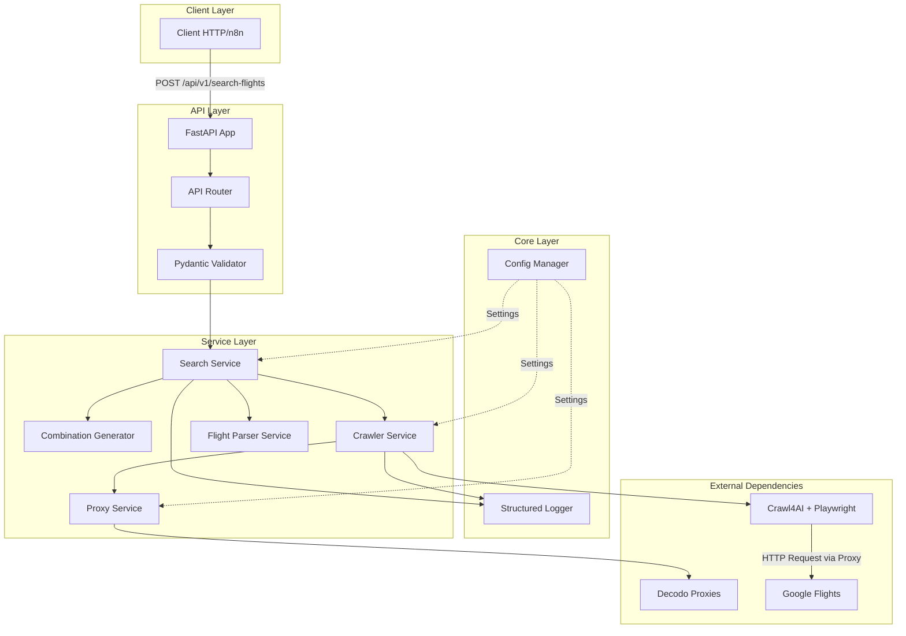
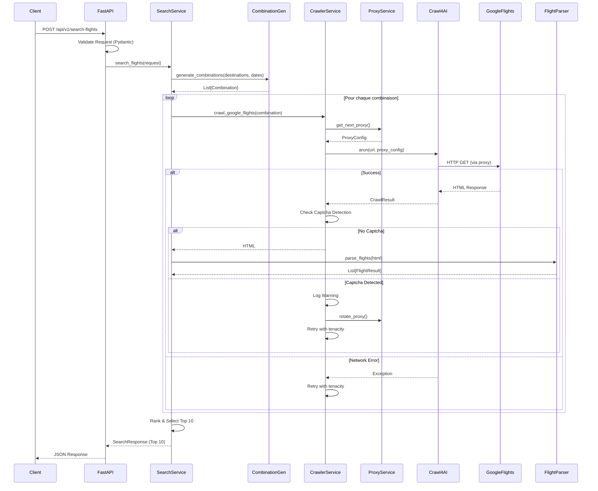

# ARCHITECTURE - flight-search-api

**API FastAPI pour recherche de vols multi-destinations via Google Flights**

**Date de création** : 16 novembre 2025

---

## 📐 Vue d'ensemble

### Objectif

Fournir une API RESTful asynchrone permettant de rechercher les meilleures combinaisons de vols multi-destinations en scrapant Google Flights, avec gestion intelligente des proxies, détection de captchas et ranking des résultats.

### Principes Architecturaux

1. **Async-First** : Architecture 100% asynchrone (FastAPI + AsyncWebCrawler)
2. **Stateless** : Pas de base de données, résultats en mémoire (Top 10)
3. **Resilient** : Retry logic avec exponential backoff + jitter
4. **Stealth** : Anti-détection via proxies résidentiels + undetected browser
5. **Cost-Efficient** : Extraction CSS (gratuit) vs LLM (payant)

---

## 🏗️ Diagrammes

### Diagramme de Composants



### Diagramme de Séquence - Recherche de Vol



---

## 🔄 Flow de Données

### Requête HTTP → Response JSON

**Étape 1 : Réception & Validation**
```
Client → POST /api/v1/search-flights
Body: {
  "destinations": ["Paris", "Tokyo", "New York"],
  "date_range": {
    "start": "2025-06-01",
    "end": "2025-06-15"
  }
}
↓
Pydantic Validation:
- Vérification format dates
- Validation destinations (non vides)
- Contraintes métier (max 5 destinations, etc.)
```

**Étape 2 : Génération Combinaisons**
```
CombinationGenerator
↓
Génère toutes les permutations multi-city possibles:
- Paris → Tokyo → New York
- Paris → New York → Tokyo
- Tokyo → Paris → New York
- ...
↓
Output: List[Combination] (N! combinaisons)
```

**Étape 3 : Crawling Parallèle**
```
Pour chaque combinaison:
  ↓
  ProxyService.get_next_proxy()
  → Rotation round-robin des proxies Decodo
  ↓
  CrawlerService.crawl()
  → AsyncWebCrawler avec:
    - Undetected browser mode
    - Proxy Decodo (residential, France)
    - Stealth mode activé
  ↓
  Crawl4AI → Google Flights
  → Requête HTTP via proxy
  ↓
  Détection Captcha:
    - Si captcha détecté → Log + Retry avec nouveau proxy
    - Sinon → Continue
  ↓
  Return HTML brut
```

**Étape 4 : Parsing & Extraction**
```
FlightParser.parse_flights(html)
↓
JsonCssExtractionStrategy:
- Sélecteurs CSS pour prix, horaires, compagnies
- Extraction structurée (pas de LLM)
↓
Output: List[FlightResult] par combinaison
```

**Étape 5 : Ranking & Sélection**
```
SearchService.rank_results()
↓
Critères de ranking:
- Prix total (poids principal)
- Durée totale trajet
- Nombre d'escales
- Compagnie aérienne
↓
Sélection Top 10 résultats
```

**Étape 6 : Response**
```
SearchResponse:
{
  "results": [
    {
      "combination": ["Paris", "Tokyo", "New York"],
      "total_price": 1250.00,
      "currency": "EUR",
      "flights": [
        {
          "from": "Paris",
          "to": "Tokyo",
          "departure": "2025-06-01T10:30:00",
          "arrival": "2025-06-02T06:45:00",
          "price": 650.00,
          "airline": "Air France"
        },
        ...
      ]
    },
    ...
  ],
  "stats": {
    "total_combinations_checked": 120,
    "successful_crawls": 115,
    "captcha_detected": 5,
    "execution_time_seconds": 45.2
  }
}
```

---

## 📋 Architecture Decision Records (ADR)

### ADR #001 : Crawl4AI + Proxies vs SerpAPI

**Contexte** : Besoin de scraper Google Flights pour récupérer les prix et horaires de vols.

**Options Considérées** :

| Critère | Crawl4AI + Decodo Proxies | SerpAPI |
|---------|---------------------------|---------|
| **Coût** | ~4€/GB + proxy overhead | $50/mois (1000 requêtes) → $0.05/requête |
| **Flexibilité** | 100% contrôle (extraction, retry, etc.) | API standardisée, moins flexible |
| **Maintenance** | Haute (gestion captchas, sélecteurs CSS) | Faible (API stable) |
| **Rate Limits** | Gérés manuellement (proxies, retry) | 1000 requêtes/mois (plan de base) |
| **Scalabilité** | Excellente (add proxies) | Limitée par plan SerpAPI |
| **Anti-détection** | Contrôle total (stealth, user-agents) | Géré par SerpAPI |

**Décision** : ✅ **Crawl4AI + Decodo Proxies**

**Justification** :
- **ROI** : Pour 1000 recherches/mois, coût estimé ~10-15€ vs $50 SerpAPI
- **Flexibilité** : Contrôle total sur extraction (CSS selectors spécifiques)
- **Scalabilité** : Pas de limite artificielle, ajout proxies à la demande
- **Learning** : Expérience scraping avancé (stealth, anti-bot)

**Conséquences** :
- ✅ Coûts variables mais prévisibles
- ⚠️ Maintenance sélecteurs CSS si Google change HTML
- ⚠️ Gestion captchas manuelle (détection + retry)

---

### ADR #002 : Decodo vs Oxylabs (Proxies Résidentiels)

**Contexte** : Besoin de proxies résidentiels pour éviter détection Google Flights.

**Options Considérées** :

| Critère | Decodo | Oxylabs |
|---------|--------|---------|
| **Prix** | ~4€/GB | ~10-15€/GB |
| **Pool IP** | 10M+ IPs résidentiels | 100M+ IPs |
| **France Targeting** | ✅ Natif (country-FR) | ✅ Natif |
| **Rotation** | Automatique (sticky sessions disponibles) | Automatique |
| **Support** | Email + Documentation | 24/7 + Account Manager |
| **Bandwidth** | Pay-as-you-go | Plans fixes ou PAYG |

**Décision** : ✅ **Decodo**

**Justification** :
- **Coût** : 60% moins cher qu'Oxylabs
- **France Targeting** : Format auth simple (`customer-{key}-country-FR`)
- **Pool IP** : 10M+ IPs largement suffisant pour MVP
- **Documentation** : Claire et complète

**Conséquences** :
- ✅ Coûts optimisés pour MVP
- ⚠️ Support moins premium qu'Oxylabs (acceptable pour MVP)
- ✅ Migration Oxylabs facile si besoin (même API format)

---

### ADR #003 : Top 10 en Mémoire (Pas de Base de Données)

**Contexte** : Stockage des résultats de recherche de vols.

**Options Considérées** :

| Critère | En Mémoire (Top 10) | PostgreSQL | Redis |
|---------|---------------------|------------|-------|
| **Complexité** | Très faible | Moyenne | Moyenne |
| **Performance** | Ultra-rapide | Rapide | Ultra-rapide |
| **Persistance** | ❌ Non | ✅ Oui | ⚠️ Optionnelle |
| **Coûts** | $0 | ~10€/mois | ~5€/mois |
| **Historique** | ❌ Non | ✅ Oui | ⚠️ Limité |
| **Scalabilité** | Stateless (parfait) | Stateful | Stateful |

**Décision** : ✅ **Top 10 en Mémoire**

**Justification** :
- **Use Case** : API stateless pour n8n → pas besoin persistance
- **Performance** : Réponse instantanée, pas de I/O DB
- **Simplicité** : Zéro infrastructure additionnelle
- **Coûts** : $0 vs 5-10€/mois DB
- **Scalabilité** : Stateless → scaling horizontal facile

**Conséquences** :
- ✅ Architecture simplifiée
- ✅ Déploiement minimal
- ❌ Pas d'historique recherches (acceptable pour MVP)
- ✅ Migration DB facile si besoin futur (ex: analytics)

---

### ADR #004 : Tenacity pour Retry Logic

**Contexte** : Gestion des erreurs réseau et timeouts lors du scraping.

**Options Considérées** :

| Critère | Tenacity | backoff (lib) | Retry manuel |
|---------|----------|---------------|--------------|
| **Async Support** | ✅ Natif | ⚠️ Partiel | ✅ Custom |
| **Wait Strategies** | 8+ stratégies | 3 stratégies | Custom |
| **Configurabilité** | Excellente | Bonne | Totale |
| **Maintenance** | Stable (9.1.2) | Stable | Custom code |
| **Logging** | Callbacks natifs | Limité | Custom |

**Décision** : ✅ **Tenacity**

**Justification** :
- **Async-First** : Support `async def` natif
- **Wait Strategies** : Exponential backoff + jitter (best practice)
- **Configurabilité** : Retry conditions spécifiques (ex: retry network errors, pas 404)
- **Logging** : Callbacks `before_sleep`, `after` pour structured logging
- **Production-Ready** : Utilisé par Airflow, Celery, etc.

**Configuration Recommandée** :
```python
@retry(
    stop=stop_after_attempt(5),
    wait=wait_random_exponential(multiplier=1, max=60),
    retry=retry_if_exception_type((httpx.TimeoutException, httpx.NetworkError))
)
async def crawl_google_flights(url: str) -> str:
    ...
```

**Conséquences** :
- ✅ Résilience réseau optimale
- ✅ Logging détaillé des retries
- ⚠️ Dépendance externe (minime, lib stable)

---

### ADR #005 : Captcha Handling Strategy (MVP : Détection Only)

**Contexte** : Google Flights peut afficher des captchas pour bloquer les bots.

**Options Considérées** :

| Approche | Coût | Complexité | Efficacité |
|----------|------|------------|------------|
| **Proxies résidentiels uniquement** | ~4€/GB | Faible | 90-95% bypass |
| **Détection + Retry avec rotation IP** | ~4€/GB | Faible | 95-98% bypass |
| **2Captcha (résolution auto)** | +$0.001-0.003/captcha | Moyenne | 99%+ bypass |
| **hCaptcha solver** | +$0.001/captcha | Moyenne | 99%+ bypass |

**Décision MVP** : ✅ **Détection + Retry avec Rotation IP**

**Justification** :
- **Proxies résidentiels Decodo** : Évitent déjà 90-95% des captchas
- **Stealth mode Crawl4AI** : Anti-détection enterprise (undetected browser)
- **Retry + Rotation IP** : Nouveau proxy → nouvelle session → contourne captcha temporaire
- **ROI** : Coût $0 vs résolution captcha ($0.001-0.003 × volume)
- **Monitoring** : Logger taux captcha pour décision data-driven

**Détection Captcha** :
```python
def is_captcha_detected(html: str) -> bool:
    captcha_patterns = [
        "recaptcha",
        "hcaptcha",
        "g-recaptcha",
        "captcha-container"
    ]
    return any(pattern in html.lower() for pattern in captcha_patterns)
```

**Stratégie Retry** :
- Captcha détecté → Log warning + metrics
- Rotation proxy automatique (ProxyService)
- Retry avec nouveau proxy (tenacity)
- Max 5 tentatives par combinaison

**Post-MVP (Phase 7 - Optionnel)** :
- **Trigger** : Si monitoring montre >5% de blocages captcha
- **Solution** : Intégration 2Captcha en fallback
- **Décision** : Data-driven après 1-2 semaines monitoring production

**Conséquences** :
- ✅ MVP rapide et économique
- ✅ Monitoring en place pour décision éclairée
- ⚠️ ~5% de recherches peuvent échouer (acceptable MVP)
- ✅ Migration 2Captcha facile si nécessaire

---

### ADR #006 : JsonCssExtractionStrategy vs LLMExtractionStrategy

**Contexte** : Extraction des données de vols depuis le HTML Google Flights.

**Options Considérées** :

| Critère | JsonCssExtractionStrategy | LLMExtractionStrategy |
|---------|---------------------------|----------------------|
| **Coût** | ✅ $0 | ❌ ~$0.01-0.05 par page (OpenAI/Claude) |
| **Performance** | ⚡ Ultra-rapide (<10ms) | 🐢 Lent (1-3s par page) |
| **Déterminisme** | ✅ 100% reproductible | ⚠️ Non-déterministe |
| **Maintenance** | ⚠️ Haute (sélecteurs CSS) | ✅ Faible (LLM adaptatif) |
| **Scalabilité** | ✅ Excellente (1000+ pages/s) | ⚠️ Limitée (rate limits API) |
| **Fiabilité** | ✅ Haute (si HTML stable) | ⚠️ Moyenne (hallucinations LLM) |

**Décision** : ✅ **JsonCssExtractionStrategy**

**Justification** :
- **Coût** : $0 vs potentiellement $100-500/mois pour 10k+ recherches
- **Performance** : 100-300x plus rapide que LLM
- **Déterminisme** : Résultats identiques à chaque exécution
- **HTML Google Flights** : Structure relativement stable
- **MVP** : Prioriser vitesse et coût

**Configuration CSS Selectors** :
```python
schema = {
    "flights": {
        "selector": ".flight-card",
        "fields": {
            "price": ".price-value",
            "departure_time": ".departure-time",
            "arrival_time": ".arrival-time",
            "airline": ".airline-name",
            "duration": ".flight-duration"
        }
    }
}
```

**Stratégie Maintenance** :
- Tests end-to-end réguliers
- Monitoring parsing failures (alertes si >5%)
- Fallback LLM uniquement si changement HTML majeur

**Conséquences** :
- ✅ Coûts opérationnels minimaux
- ✅ Performance optimale
- ⚠️ Maintenance sélecteurs CSS si Google change HTML
- ✅ Fallback LLM possible si nécessaire (architecture modulaire)

---

## 🎯 Décisions Complémentaires

### Logging Structuré (JSON)

**Décision** : Utiliser `python-json-logger` pour logs structurés

**Justification** :
- Machine-readable (parsing facile)
- Contexte métier riche (search_id, proxy_used, captcha_detected)
- Compatible Grafana/Loki/CloudWatch

### Configuration (Pydantic Settings)

**Décision** : `pydantic-settings` pour env vars

**Justification** :
- Validation automatique
- Type safety
- Auto-documentation (.env.example)

### Tests

**Stratégie** :
- **Unit** : Mocks Crawl4AI, Decodo, HTML responses
- **Integration** : TestClient FastAPI
- **Coverage** : Minimum 80%

---

## 📊 Métriques & Monitoring

### Métriques Clés

| Métrique | Seuil Alerte | Action |
|----------|--------------|--------|
| **Taux captcha** | >5% | Évaluer intégration 2Captcha |
| **Parsing failures** | >5% | Vérifier sélecteurs CSS |
| **Proxy bandwidth** | >50GB/mois | Optimiser requêtes |
| **Response time p95** | >60s | Optimiser parallélisation |

### Logging Essentiel

```python
logger.info(
    "Flight search completed",
    extra={
        "search_id": uuid,
        "combinations_checked": 120,
        "successful_crawls": 115,
        "captcha_detected": 5,
        "top_price": 1250.00,
        "execution_time": 45.2,
        "bandwidth_consumed_mb": 24.5
    }
)
```

---

## 🚀 Évolutions Futures

### Phase 7 (Post-MVP) : Captcha Solving

**Trigger** : Monitoring montre >5% taux captcha

**Solutions** :
1. Intégration 2Captcha (résolution auto)
2. Optimisation proxies (pools dédiés)
3. Rate limiting intelligent

### Extensions Possibles

- **Cache Redis** : Résultats temporaires (15min TTL)
- **Analytics DB** : Historique recherches, tendances prix
- **LLM Fallback** : Si Google change drastiquement HTML
- **Webhooks** : Notifications recherches terminées
- **Multi-Currency** : Support USD, GBP, etc.

---

**Dernière mise à jour** : 16 novembre 2025
